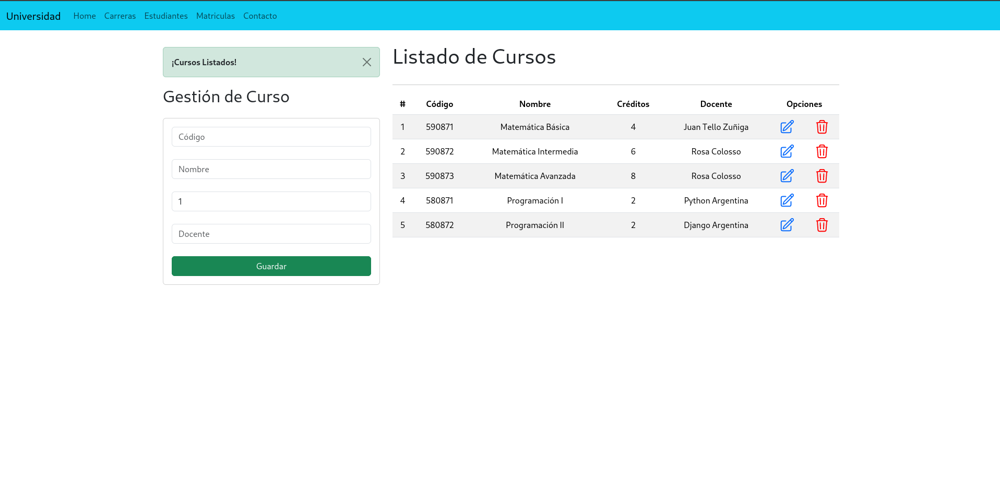
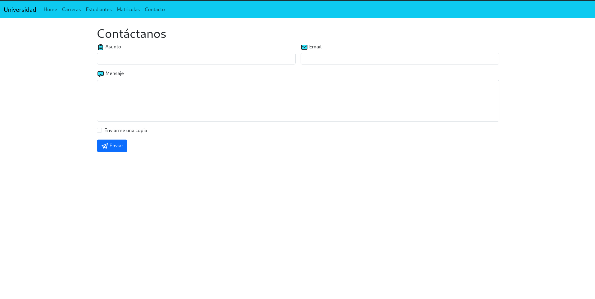
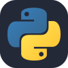

# MiUniversidad

* Objetivo
* Herramientas
* Conclusión

---
## Objetivo
El objetivo de este respositorio es subir mis prácticas, en este caso utilizando cómo lenguaje de programación **Django**.  
Después de investigar e ir comparando código, haciendo mi primer tutorial de YouTube, fuí desarrollando de a poco esta app, la misma está pensada para administrar una universidad, cargar carreras, cursos, alumnos e ir editando los datos de los mismos.  
Esta app es con fines educativos, no soy responsable por el uso que se le de a la misma.

## Herramientas

&nbsp;&nbsp;&nbsp;

&nbsp;&nbsp;&nbsp;

&nbsp;&nbsp;&nbsp;

&nbsp;&nbsp;&nbsp;

## Conclusión
